<h1>String</h1>

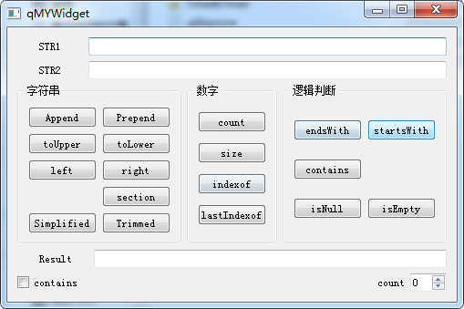

<h1>SliderScorll</h1>

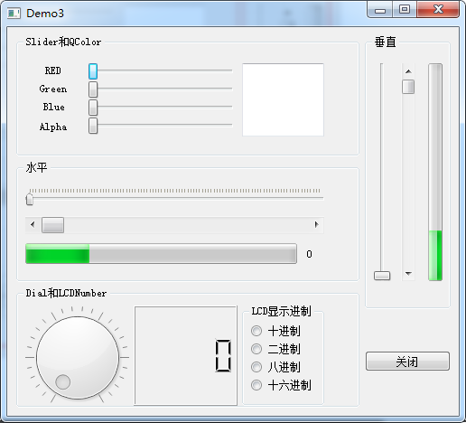

<h1>Timer</h1>

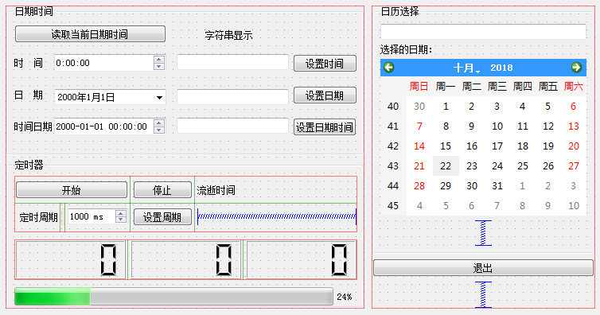

<h1>ComboPlaintextedit</h1>

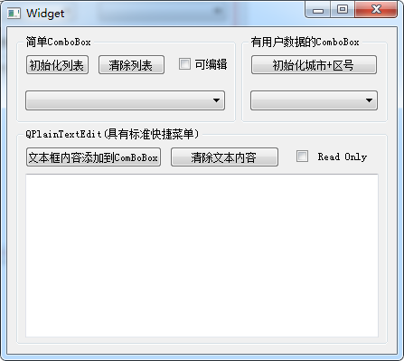

<h1>ListWidget</h1>

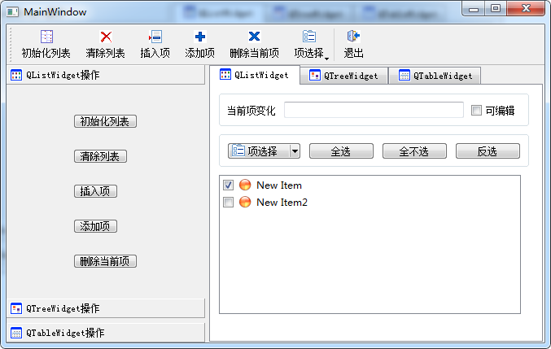

<h1>FileSystemModel</h1>

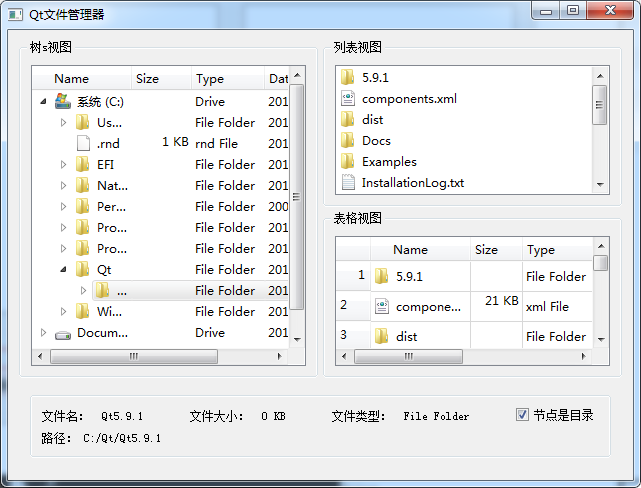

<h1>StringListModel</h1>

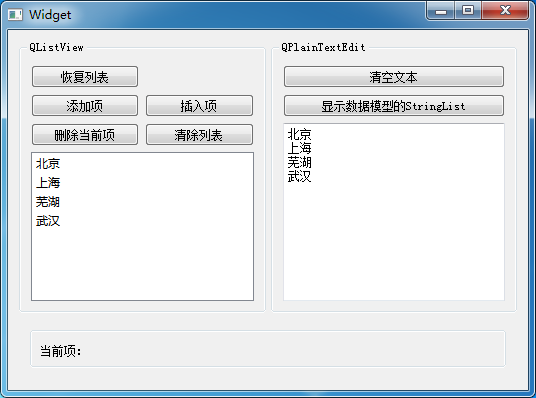

<h1>StandardItemModel</h1>

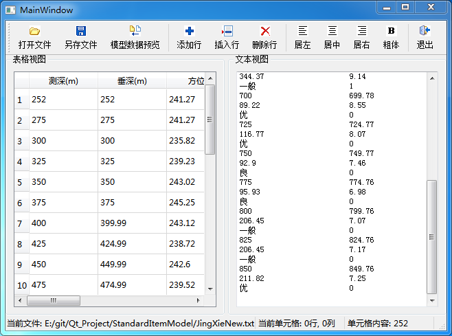

<h1>FileDialog</h1>

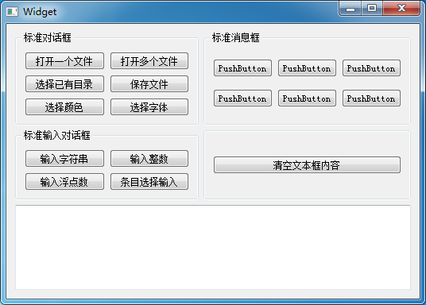

<h1>CustomDialog</h1>

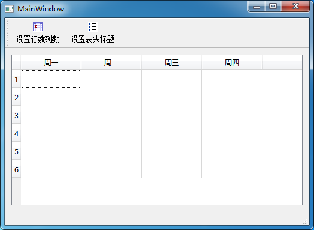

<h1>MutliWindowDesign</h1>

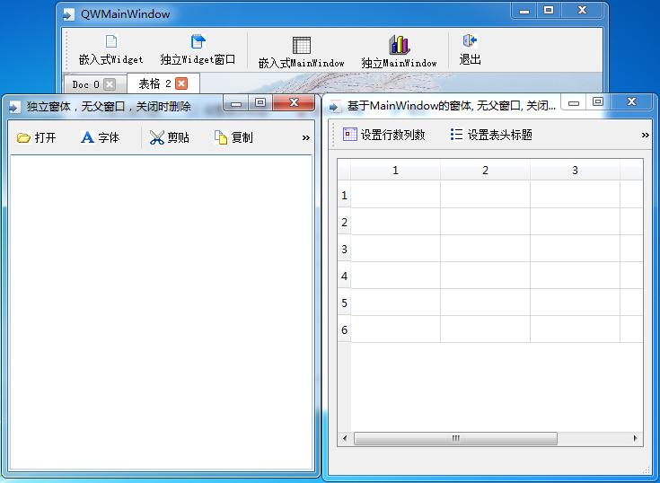